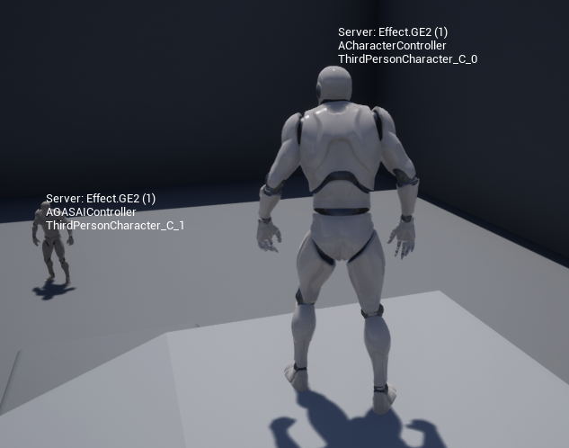
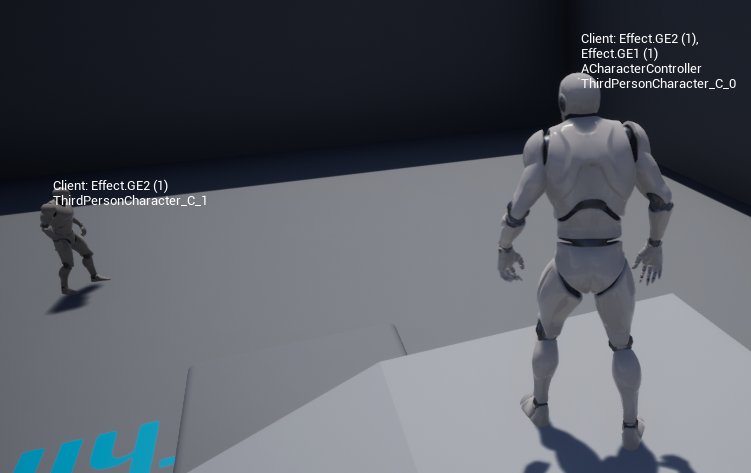
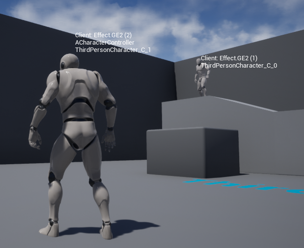

Simple UE4 project with GameplayAbility System.
================================================

General overview
----------------

The main goal of this project is to demonstrate the issues we faced with Ability System. This project conceptually illustrates our approach to using GAS.
The ManualControl ability activates from server, bur runs on client. It listen local gamepad and applies Gameplay abilities on server. This ability activates by tag *Ability.ManualControll*. This ability can activate two other gameplay abilityes:
- GA1
- GA2

GA1 ability:
- activates by tag *Ability.GA1*
- cancel all abilities with tag *Ability* 
- applies GamePlay Effect GE1
    - this effect removes all effects with tag *Effect* and applies its own tag *Effect.GE1*
GA2 ability:
- activates by tag *Ability.GA2*
- cancel all abilities with tag *Ability* 
- applies GamePlay Effect GE2
    - this effect removes all effects with tag *Effect* and applies its own tag *Effect.GE2*

The *ManualControll* ability is activated in `void ACharacterController::OnPossess(APawn* InPawn)` method.
During its activation this ability creates ability task *UAbilityTask_InputHandler*. This task handles input from local game-pad and activates corresponded abilities (*GA1*, *GA2*) on server.

The character switching process fiers from the `void UGameplayAbility_ManualControl::SwitchGASCharacter(AGASCharacter* FromAGASCharacter)` method and calls ServerRPC for Character object. The characters swapping itself is implemented in the `SwapControllers` method below.

```
void UCharacterSelector::SwapControllers(AGASCharacter* FromCharacter, AGASCharacter* ToCharacter)
{
    const auto FromController = FromCharacter->GetController();
    const auto ToController = ToCharacter->GetController();

    if (!FromController || !ToController)
    {
        UE_LOG(LogTemp, Error, TEXT("%s (FromCharacter) CharacterSelector::SwitchCharacter One of controllers is null"),
            FromCharacter->HasAuthority() ? *FString("Server ") : *FString("Client "));

        return;
    }

    FromController->Possess(ToCharacter);
    ToController->Possess(FromCharacter);

    UE_LOG(LogTemp, Display, TEXT("%s (FromCharacter) %s (ToCharacter) CharacterSelector::SwitchCharacter Controllers switched"),
        FromCharacter->HasAuthority() ? *FString("Server ") : *FString("Client "),
        ToCharacter->HasAuthority() ? *FString("Server ") : *FString("Client "));
}
```

How to run
----------

Play mode:
- Number of Players: 1
- Net Mode: Play As Client

Press X/B on game-pad to activate one of two ability which applies one of two Gameplay Effect.

Press Y on game-pad  to switch characters.

Issues with GameplayAbility System we faced
-------------------------------------------

- We can't activate ability right after Possess, because AbilityActorInfo does not have time to replicate. Therefore, at the time of activation Client Side NetMode of Avatar ROLE_SimulatedProxy. So we have added delay in 1 second before activating the *ManualControll*.
- On the client the effect which we apply not always removes already applied tag.

More details about tags removing. In case it runs as listen server - everything works correctly. We have only one tag per actor as we expect. See the picture below.


In case it runs as Client the behavior is different.
If you switch to another character and apply any Ability (GA1 or GA2) your character will have *two*(!) tags. In case you switch back to the first character and apply ability too you also will get two tags here. You could see such situation on the two screenshots bellow. These two screenshots was made with the same state to illustrate tags on characters. *Note*, you can see the correct tags on non-owned character!



Here you own ThirdPersonCharacter_C_0. It has two tags applied: Effect.GE2 (one item) and Effect.GE1 (one item). But for ThirdPersonCharacter_C_1 you could see only Effect.GE2 (one item)! Now let's look at the next pic.



This screenshot made after switching to another character.
Here you own ThirdPersonCharacter_C_1. It has two tags applied: Effect.GE2 (two items). But for ThirdPersonCharacter_C_0 you could see only Effect.GE2 (one item) but not see Effect.GE1!

This is unexpected (as far I understand GAS) behavior. I expect to see only one tag for both characters. Actually after some time I the wrong tag disappears, but it happens not every time and after some amount of time (more then 10 seconds more or less). I assume it is synchronization issue, but I not see way to fix it (.
